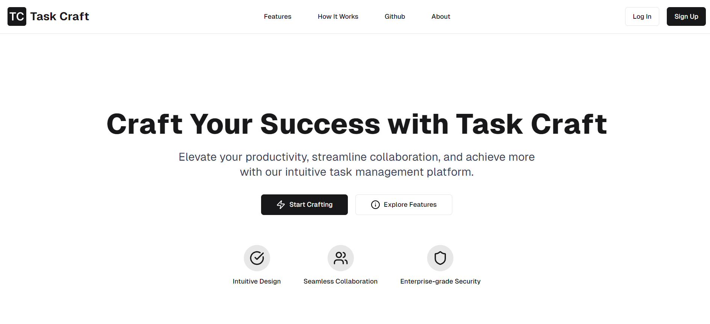

<p align="center">
  
</p>

<h1 align="center">TaskCraft 🚀 - Elevate Your Task Management</h1>

<p align="center">
  
</p>

<h2 align="center">
  <a href="https://taskcraft-dev.vercel.app">🌟 Experience TaskCraft Live! 🌟</a>
</h2>

<hr/>

Welcome to TaskCraft, your ultimate collaborative task management solution! 🎉 Inspired by Trello, TaskCraft empowers teams to create, manage, and track tasks with unparalleled ease. Our intuitive board system, featuring drag-and-drop organization, dynamic lists, and interactive cards, takes your productivity to new heights! 📈

<hr/>

## 📚 Table of Contents

- [✨ Features](#-features)
- [🛠️ Installation](#️-installation)
- [🚀 Getting Started](#-getting-started)
- [💡 Experience](#-experience)
- [🔧 Technologies Used](#-technologies-used)
- [📄 License](#-license)
- [📞 Contact & Support](#-contact--support)

<hr/>

## ✨ Features

Discover the power-packed features of TaskCraft:

- 🗂️ **Board Creation & Management**: Organize projects with customizable boards
- 📝 **Card Operations**: Create, edit, copy, and delete tasks effortlessly
- 🔄 **Drag & Drop**: Intuitive reordering of lists and cards
- 📊 **Audit Logs**: Comprehensive activity tracking for enhanced accountability
- 📱 **Responsive Design**: Optimal experience across all devices
- 🔐 **Secure Authentication**: Clerk-powered login with OAuth support

<hr/>

## 🛠️ Installation

Get TaskCraft up and running on your machine:

### Prerequisites

Ensure you have the following installed:
- 📦 Node.js and npm
- 🐘 PostgreSQL (NeonDB or local setup)
- 🐙 Git

### Step-by-Step Setup

1. **Clone the repository:**
   ```bash
   git clone https://github.com/yourusername/taskcraft.git
   ```

2. **Navigate to the project directory:**
   ```bash
   cd taskcraft
   ```

3. **Set up environment variables:**
   Create a `.env` file in the root directory and add the following variables:
   ```
   NEXT_PUBLIC_CLERK_PUBLISHABLE_KEY=your_clerk_publishable_key
   CLERK_SECRET_KEY=your_clerk_secret_key
   NEXT_PUBLIC_CLERK_SIGN_IN_URL=/login
   NEXT_PUBLIC_CLERK_SIGN_UP_URL=/sign-up
   NEXT_PUBLIC_UNSPLASH_ACCESS_KEY=your_unsplash_access_key
   DATABASE_URL="your_neondb_connection_string"
   ```
   Replace the placeholder values with your actual credentials.

4. **Install dependencies:**
   ```bash
   npm install
   ```

5. **Set up the database:**
   ```bash
   npx prisma generate
   npx prisma db push
   ```

6. **Start the development server:**
   ```bash
   npm run dev
   ```

Your TaskCraft application should now be running on `http://localhost:3000`.

<hr/>

## 🚀 Getting Started

After setup, launch your browser and navigate to:

- Frontend: `http://localhost:3000`
- Backend API: `http://localhost:3001`

Start by creating your first board and exploring the intuitive interface!

<hr/>

## 💡 Experience

During the development of TaskCraft, I gained valuable experience in several key areas:

- **Full-Stack Development** 💻: Built a robust backend using Prisma and NeonDB (PostgreSQL) and a dynamic frontend with React.js.
- **Next.js Framework** ⚛️: Leveraged the power of Next.js for server-side rendering and dynamic routing.
- **Prisma ORM** 🗄️: Used Prisma to efficiently manage database schemas and operations with PostgreSQL.
- **Collaboration** 👫: Integrated real-time collaboration features for enhanced productivity.
- **Responsive Design** 📱: Created a mobile-first design for accessibility across all devices.
- **Authentication with Clerk** 🔑: Implemented secure user authentication and authorization using Clerk with OAuth integration for Google and GitHub.
- **State Management** 🔄: Utilized React Query for efficient state management and data fetching.
- **UI/UX Design** 🎨: Focused on creating an intuitive and visually appealing user interface.
- **Performance Optimization** ⚡: Implemented techniques to ensure fast load times and smooth user experience.
- **API Development** 🔌: Designed and implemented RESTful APIs for seamless frontend-backend communication.
- **Version Control** 📚: Practiced Git workflows for efficient collaboration and code management.

This project helped me improve my understanding of full-stack development and real-world problem-solving techniques in task management systems.

<hr/>

## 🔧 Technologies Used

- ⚛️ React.js (JavaScript library for building user interfaces)
- 🔼 Next.js (React framework for production-grade applications)
- 🗄️ Prisma (Next-generation ORM for Node.js and TypeScript)
- 🐘 PostgreSQL (Powerful, open-source relational database system)
- 🌟 NeonDB (Serverless PostgreSQL with a generous free tier)
- 🔐 Clerk (Complete user management and authentication solution)
- 🎨 Tailwind CSS (Utility-first CSS framework for rapid UI development)
- 📝 React Hook Form (Efficient, flexible and extensible forms with easy-to-use validation)
- 🛡️ Zod (TypeScript-first schema validation with static type inference)
- ⚡ Server Actions (Next.js feature for handling form submissions and data mutations)
- 🚀 Vercel (Platform for deploying and scaling Next.js applications)
- 🐙 Git (Distributed version control system)

<hr/>

## 📄 License

TaskCraft is licensed under the MIT License. See the [LICENSE](LICENSE) file for more details.

<hr/>

## 📞 Contact & Support

- For feedback and support, email us at saxenashourya000@gmail.com 📧
- Follow me on [LinkedIn](https://www.linkedin.com/in/shouryasaxena) for updates 🔗
- Check out my [GitHub](https://github.com/SaxenaShourya) for more projects 🐙

We're always looking to improve TaskCraft. If you have any suggestions or find any bugs, please open an issue on our GitHub repository.

If you find TaskCraft helpful, please consider giving it a star ⭐ on GitHub! Your support means a lot to us and helps others discover the project.

<hr/>
